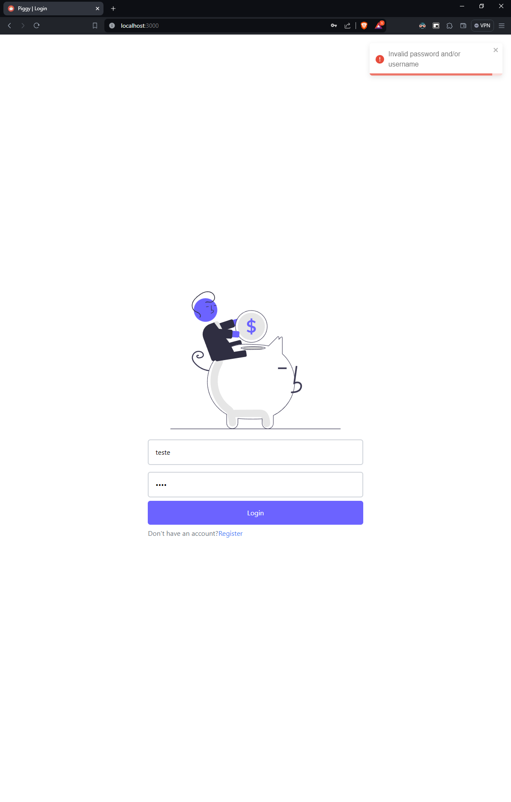
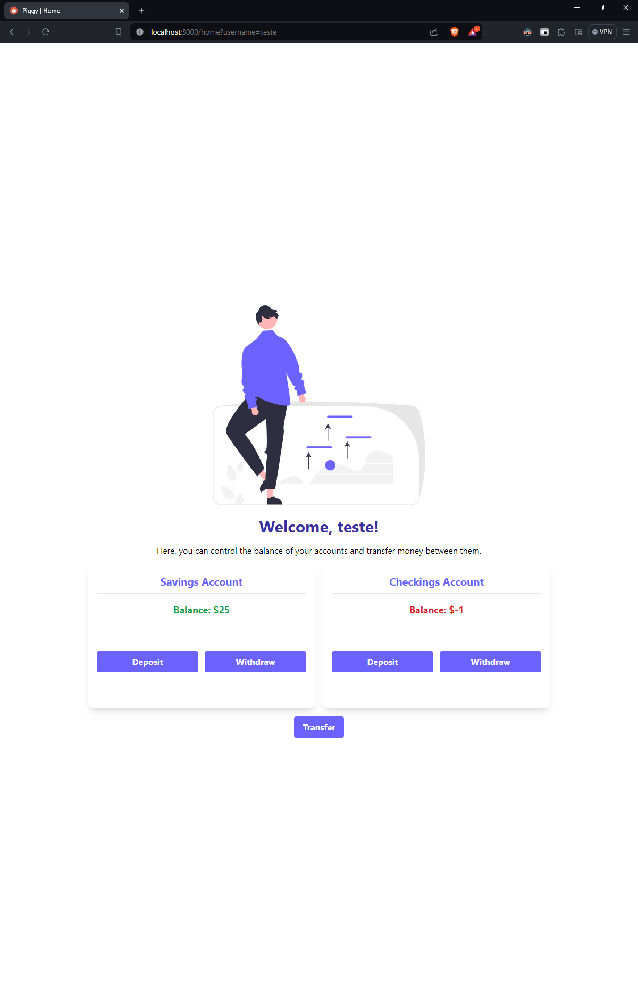
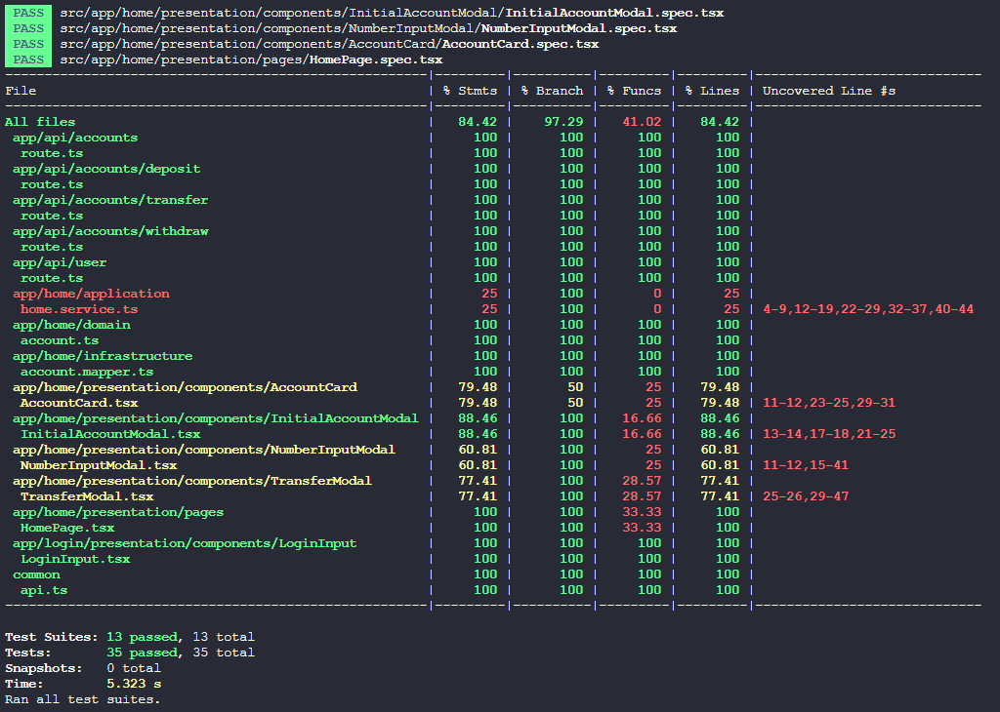

## Piggy Bank

[//]: <> (It was really fun to develop this project. The tech challenges were perfect to understand even more concepts of testing and development.)

[//]: <> (I would like to thank SCALIS.ai https://scalis.ai/ for the opportunity to showcase my work and skills.)

In this document, I explain some features implemented and some decisions taken into account during development.

---

### Running the application
The application was made only with NextJS for frontend and backend purposes, to run it, just:
1. Clone this repository
2. Run `npm install`
3. Run `npm run dev` for development build or `npm run build && npm run start` for production.
4. Enjoy :)

---

### Frontend
Using the `create-next-app` template as base, I created two pages:

#### Login Page
This page has a simple form to simulate the real user experience of a login system. It doesn't contain all the features needed to imlement a secure login, like JWT token auth and cryptography, but all of this can be easily implemented.

Future changes
1. Add JWT authentication
2. Use HTTPS protocol
3. Use SHA-1 or any cryptography algorithm to encrypt data.

You can access the application via login accessing http://localhost:3000 and using `teste` for username and `teste123` for password.

> This and all pages have validations for simple exceptions. Example: You put a wrong username or password, it will prompt you in the top-right corner.

#### Home Page

When you are realizing the first login, the system request you to fill the initial values for the two accounts. After that, you have full control over the accounts.

According to the requirements, the project has savings and checkings account control, making it possible to insert values on each account, remove values and also make transactions between them.

This design take into account usability, with focus only on the core functions of the system.

Future changes
1. Better card design
2. Add operations log to view deposits, withdraws and transfers that occured.
3. Add option to control more than two accounts

---
### Backend
The Backend uses NextJS and SQLite with PrismaORM to interface between them. 

Every backend API route was developed using the concept of server-side rendering and [API Route Handlers](https://nextjs.org/docs/app/building-your-application/routing/route-handlers) from NextJS. This concept is important, because it garantees to run the prisma calls on server-side, making the application run faster without any problem at all.

To attain that, I created a folder called `api` inside `src/app` to store all files related to backend and database calls.

#### Migrations
During development, I created migrations to handle database structure changes using prisma.

This can ensure that my database is up-to-date with my application and also permits that I change the database driver with much less effort.

### Unit tests

As mentioned at the [Backend](#backend) section, I've used API Route Handlers from NextJS to make asynchronous server-side calls to the database.

Every function that connects to the SQLite database was tested using Jest. The respective files have 100% code coverage.

For the frontend components, every component has a test written for it, they have ~70% coverage because of some functions that were not tested. This was not the priority, because the frontend access only functions defined on the 100% teste coverage files from API.

To run the tests and check the code coverage, just run `npm run test` on the command-line.

Future changes
1. Create more tests to improve code coverage
2. Add mock Database for testing
3. Add e2e tests

Here is the result of the testing command:

--- 
### Deployment

NextJS has an incredible integration with [Vercel](https://vercel.com/), so I made an autonomous deploy when some changes are merged into the `main` branch.

This is the [Deployment](https://piggy-bank-eight.vercel.app/). But Vercel can't use SQLite as database, so the user can't make login or anything in the system.

Future changes
1. Add steps for automated testing
2. Change database to PostgreSQL

---
### What would you improve if given more time?

- Add an Account Register Page
- Implement changes descripted above
- Think of different designs for UX and UI.
---
### That's it!
Thanks for your time, and if you have some issues and suggestions. Contact me on my [E-mail](mailto:hentz.dev@gmail.com) :)

Rafael Augusto Hentz
